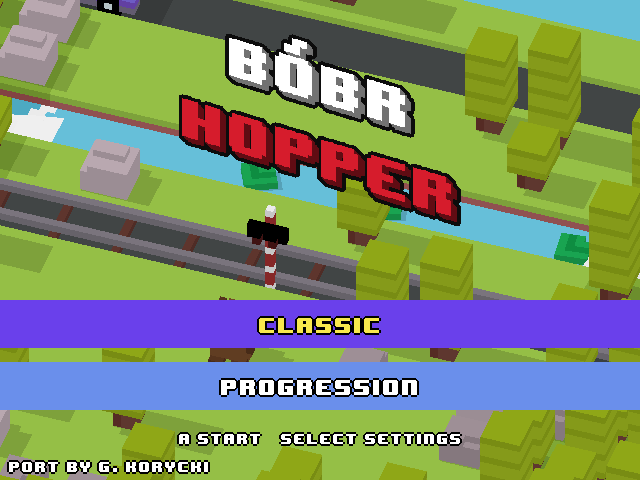

# Bóbr Hopper — SF2000 / GB300

A hopping game for the **Data Frog SF2000** and **GB300** handhelds: a native C++17 libretro core with its own
software renderer, running at 320×240 on a 918 MHz MIPS32 CPU **with no floating-point unit**.

Current build: **v027**.



## What this is based on

The game logic is a port of **[EvanBacon/expo-crossy-road](https://github.com/EvanBacon/expo-crossy-road)**
(MIT, commit `6f2e84e5`) — an open-source TypeScript + three.js game that is itself a study of the arcade
hopping genre. That project's structure, timings and behaviour were followed closely: rows, traffic, logs and
the hero's hop all reproduce what the original does, which is why the repository keeps a copy of that project's
assets and a trace harness that compares this port against a reference run of the original, step by step.

**No audio from the original project is included here.** Every sound this game plays was made for the port, and
the archive in `upstream/` has had its audio folder removed — that is why it is named `-noaudio`. The models,
images and font that remain in it are MIT, like the rest of that project.

**This project is not affiliated with, endorsed by, or connected to Hipster Whale, Yodo1 or the "Crossy Road"
game or trademark.** It is a hobby port of an MIT-licensed open-source project, with its own name, its own
artwork and its own sounds.

## What was added on top of the original

- **Fixed-point everywhere.** The SF2000 has no FPU, so the whole game runs on 16.16 fixed-point numbers
  (`src/engine/real.h`); `build/check_softfloat.sh` fails the build if a single soft-float call reaches the core.
- **A software renderer** (`src/sw`): painter's order, no depth buffer, flat-shaded triangles baked from the
  original's models, plus box shadows. ~30 fps on the device.
- **Progression mode** beside the endless Classic mode: levels of 10·k rows with a chequered finish line, a
  career that remembers the level reached, a rank for every level, and a fanfare halfway through.
- **A difficulty curve that keeps going.** The first rows are gentle for small children; from 150 points the
  *slowest* traffic, logs and railroad spacing are cut away one layer at a time, and the minimum number of
  dangerous rows in a row keeps climbing with no ceiling (`src/game/difficulty.h`).
- **A guaranteed way forward:** every generated row is checked to be crossable (`build/path_check.sh`).
- **Our own hero and artwork:** a voxel beaver (`tools/make_beaver.py`) as the default character, the chicken
  kept as an alternative, an isometric wordmark (`tools/make_logo.py`), and **every sound effect replaced** with
  our own recordings and generated takes.
- **English and Polish** interface text, chosen in the settings.
- Fixes to behaviour the original shares with its own source: a chain of fast hops could carry the hero over a
  river or a railway; a hero riding a log could be drawn *under* it. Each fix has a check script in `build/`.

Every deliberate deviation from the original sits behind `GameContext::originalBehaviour`, so the trace
comparison against the original still runs clean.

## Building

You need:

- **Windows with Git Bash** and **Python 3** (the bakers use Pillow: `pip install pillow fonttools`).
- **WSL** with Ubuntu 22.04 and the **Codescape `mips-mti-elf` GCC 7.4.0** toolchain unpacked in
  `/opt/mips32-mti-elf/2019.09-03-2/` (or `/tmp/...`).
- The **SF2000 multicore framework** checkouts — these are third-party projects and are *not* redistributed here:
  - `sf2000_multicore_official` and `gb300_multicore` (multicore menu builds),
  - the FrogUI `sf2000_multicore` tree (FrogUI builds).

  Point the build at their parent directory with `SF2000_BASE_ROOT` (it defaults to the author's layout):
  the script expects `$SF2000_BASE_ROOT/Temp/sf2000_multicore_official`,
  `$SF2000_BASE_ROOT/Temp/gb300_multicore` and `$SF2000_BASE_ROOT/Temp_FrogUI/sf2000_multicore`.

Then:

```sh
sh build/setup_tools.sh        # fetches the PC toolchain used by the dev tools (zig, SDL2)
sh build/bake_all.sh           # unpacks the upstream tarball and bakes the shared data/
sh build/bake_sf2000.sh        # bakes data_sf2000/ (flat meshes, half-size fonts, ADPCM music)
sh build/build_sf2000.sh sf2000_core
```

That produces all four device variants:

```
out/sf2000/core_87000000_sf2000_mc        SF2000, multicore menu
out/sf2000/core_87000000_gb300_mc         GB300, multicore menu
out/sf2000/core_87000000_sf2000_frogui    SF2000, FrogUI
out/sf2000/core_87000000_gb300_frogui     GB300 V2, FrogUI
```

Package them for a card:

```sh
sh build/package_sf2000.sh v027      # -> out/sf2000/BobrHopper-SF2000-v027/ and .zip
```

## Installing on the console

Copy the contents of `KARTA/` onto the card (merging with the existing `ROMS\`), then **one** of the
`CORE_*/cores` folders (merging with `cores\`), so the card holds `cores\bobrhopper\core_87000000`.

- multicore menu: start `bobrhopper;BobrHopper` from the game list
- FrogUI: folder `bobrhopper`, file `BobrHopper`

Settings and the best score are kept in `ROMS\bobrhopper\conf\crossy.cfg`.

**Controls:** D-pad hops (on release, like the original), A hops forward / starts a new game, Start pauses,
Select opens the settings, B goes back, Select + L shows the frame counter.

## Testing without the console

Most of the work happens on the PC:

```sh
sh build/build_pc.sh sw_game     # the 16.16 game drawn by the software renderer, with screenshots
sh build/build_pc.sh trace       # the logic tracer used by every check script
sh build/smoke_test.sh           # a bot plays 20000 steps; the digest must not move
sh build/host_smoke.sh           # the real core in a libretro host, incl. the on-device digest
sh build/check_softfloat.sh      # no floating point reached the core
sh build/run_traces.sh           # this port against a reference run of the original
```

`build/*_check.sh` are the regression checks written for specific bugs — each one's header explains the bug it
guards against.

## Layout

```
src/game      the game itself, shared by every platform
src/engine    maths, assets, audio, config - no SDL, no floating point on the SF2000 path
src/ui        HUD, menus, ranks, translations
src/sw        the software renderer (SF2000 only)
src/sf2000    the libretro core, the firmware glue, the ADPCM mixer
apps          the PC tools: libretro host, renderer runner, tracer
tools         asset bakers (meshes, fonts, sounds, music) and the card sync script
assets_extra  our own models, images and sounds - a file here overrides the baked upstream asset
release/      built packages, ignored by git (see release/README.md)
```

## Credits

- **[Evan Bacon](https://github.com/EvanBacon/expo-crossy-road)** — the original open-source game this port
  follows, MIT licensed. [NOTICE.md](NOTICE.md) says which part of this repository is whose.
- The SF2000 multicore and FrogUI framework authors, whose loader makes a custom core possible at all.
- Port, artwork and sounds: G. Korycki, with Claude Code.

## Po polsku

**Bóbr Hopper** to gra na konsolki **SF2000** i **GB300** — natywny rdzeń libretro w C++17 z własnym
programowym rendererem, 320×240, w całości na liczbach stałoprzecinkowych 16.16 (ta konsola nie ma jednostki
zmiennoprzecinkowej).

Logika gry to port otwartoźródłowego projektu **expo-crossy-road** Evana Bacona (licencja MIT). Projekt **nie jest**
powiązany z firmą Hipster Whale ani z grą „Crossy Road" — ma własną nazwę, własną grafikę i własne dźwięki.

Co doszło ponad pierwowzór: tryb progresji z poziomami, metą i rangami, kariera zapamiętywana między grami,
trudność rosnąca bez końca od 150 punktów, gwarancja przejścia każdego rzędu, bóbr jako domyślny bohater,
własne logo, wszystkie dźwięki wymienione na własne oraz polski i angielski interfejs.

Budowanie i instalacja — jak w sekcjach powyżej. Ustawienia i rekord konsola trzyma w
`ROMS\bobrhopper\conf\crossy.cfg`.
